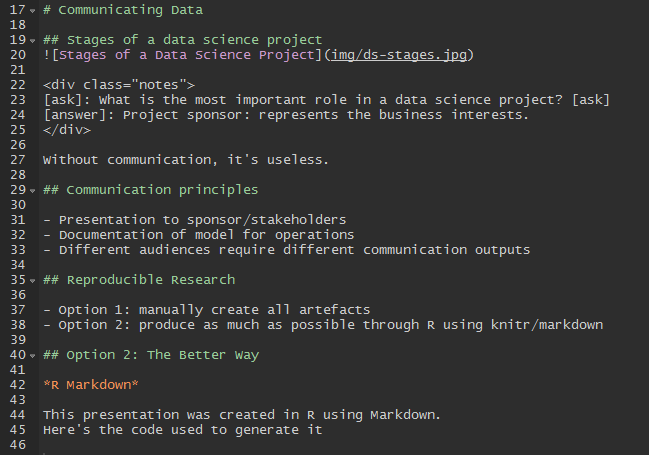

```{r setup, include=FALSE}
knitr::opts_chunk$set(echo = TRUE, message = FALSE)
```

# Communicating Data

## Stages of a data science project


<div class="notes">
[ask]: What is the most important role in a data science project? [ask]
[answer]: Project sponsor: represents the business interests. 
</div>

Without communication, it's useless. 

## Communication principles

- Presentation to sponsor/stakeholders
- Documentation of model for operations
- Different audiences require different communication outputs

## Reproducible Research

- Option 1: manually create all artefacts
- Option 2: produce as much as possible through R using knitr/markdown

## Option 2: The Better Way

*R Markdown* 

This presentation was created in R using Markdown.
Here's the code used to generate it



Prefer minimal text to generate clean, readable output

## Notebooks

In addition to presentations, you can create entire notebooks that
capture the research process. 

Notebooks contain both markdown and results from R Code

## Markdown


Help > Markdown Quick Reference

## Code Chunks

You can quickly insert chunks like these into your file with the keyboard 
shortcut Ctrl + Alt + I, the Add Chunk  command in the editor toolbar
or by typing the chunk delimiters \`\`\` {r} and \`\`\`.

When you render your .Rmd file, R Markdown will run each code chunk and embed 
the results beneath the code chunk in your final report.

```{r}
# This is an example code chunk
print(sqrt(2))
```

## Theory

*Options*

1. Use Markdown for the entire project, for peer/self-documentation, OR
2. Use Markdown for communicating the results and findings of a project to a 
broader audience, OR
3. BOTH!

## Examples 

analytics.rmd

