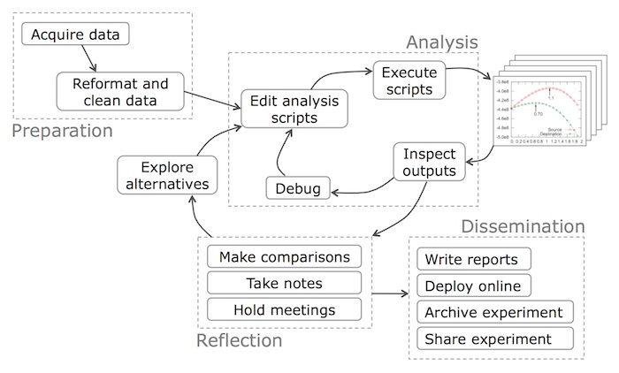

```{r setup, include=FALSE}
knitr::opts_chunk$set(echo = TRUE, message = FALSE)
```

# Communicating Data

## Stages of a data science project


<div class="notes">
[ask]: What is the most important role in a data science project? [ask]
[answer]: Project sponsor: represents the business interests. 
</div>

Without communication, it's useless. 

## Communication principles

- Presentation to sponsor/stakeholders
- Documentation of model for operations
- Different audiences require different communication outputs

## Reproducible Research

- Option 1: manually create all artefacts
- Option 2: produce as much as possible through R using knitr/markdown

## Option 2: The Better Way

*R Markdown* 

This presentation was created in R using Markdown.
Here's the code used to generate it


Prefer minimal text to generate clean, readable output

## Notebooks

In addition to presentations, you can create entire notebooks that
capture the research process.


