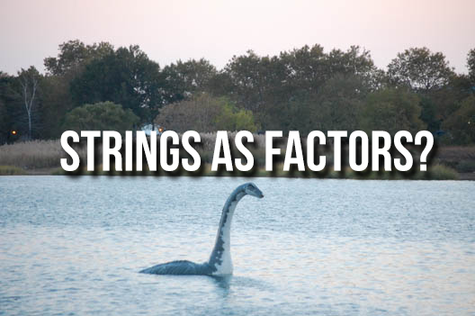
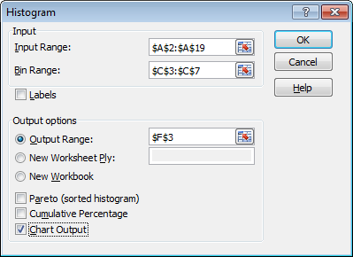

```{r setup, include=FALSE}
PROJ_ROOT <- rprojroot::find_rstudio_root_file()
knitr::opts_chunk$set(echo = TRUE, message = FALSE)
knitr::opts_knit$set(root.dir = PROJ_ROOT)
```
## Before we begin

- Did you install R and RStudio? If not, start it now. Instructions
are in the booking

## About Me

> - BSc at University of Toronto: Psych and English
> - Joined RBC in 2006
> - Technial Support (1st/2nd line) for Helpdesk (TSC)
> - Business Analyst for Enterprise Service Desk (ESD)
> - Problem Manager for IPM (Incident & Problem Management)
> - Analyst with SSPM (Sales and Service Performance Management)
> - Analyst with PSA (Performance Strategy & Analytics)

## 


## In the beginning there was S..



## 

R is a programming language built by statisticians for statisticians, 
based on another programming language called S. R is the free, open-source 
successor to S, and is not without its quirks.

Many of these have been overcome through clever packages
that hide a layer of complexity. Sometimes, that ugly layer
surfaces through though, so be aware. 

## And then there was R..

R's quirks come from an empahsis on data analysis & data science, and
the unique methods and processes data analysts go through. Despite quirks,
there a number of benefits! 

> * Interactive: unlike SAS, you can try bits and pieces of code fragments.
> * Documented: unlike Excel, R code (especially RMarkdown) lend itself to 
documenting your work, which is great for self- and peer-review
> * Iterative: Also unlike Excel, when 'someone' wants to see a histogram with 4 
bins instead of 3, it's a simple change.
> * Repeatable: You can give your project to someone else, and they can run the
analysis and get the same result. 

## Most importantly...

> * Fun: You might find yourself actually enjoying yourself once you see how
easy it is to build visualizations and models
> * Powerful: You can plot twenty distributions and scatter plots in the time
it takes you to write a couple vlookups. You're no longer limiting your analysis
because of the tool you use.
> * Cutting-edge: Constantly being updated. You can create simple slides that 
execute code (like this one) or build web apps (Shiny).

*** 

```{r echo=T, fig.height=5, fig.width=8, warning=F}
library(GGally)
library(ggplot2)
ggpairs(iris, aes(colour = Species))
```

## Ok that's nice but I have Excel..

Apart from the important theoretical things like reproducibility and reducing
error, try this in Excel.



*** 

> 1. I give you a dataset
> 2. Create statistical summaries, histograms, and a model.
> 3. I change the dataset.
> 4. Sold yet?

## RStudio - Interactive Development


R is the programming language
RStudio is the programmer's interface
RStudio makes it easier to code using R, and it brings with it
a wealth of cool features. 

*** 


