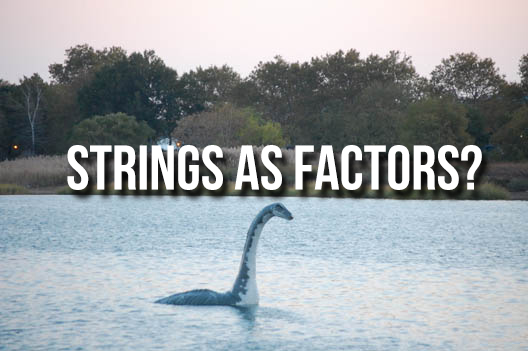
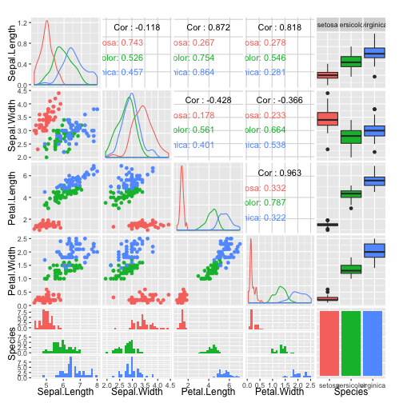

A Short Hike with R
========================================================
author: Pedram Roshdinavid
date: August 8 2016
autosize: true

In the beginning there was S..
========================================================

***

R is a programming language built by statisticians for statisticians, 
based on another programming language called S. R is the free, open-source 
successor to S, and is not without its quirks.

Many of these have been overcome through clever packages
that hide a layer of complexity. Sometimes, that ugly layer
surfaces through though, so be aware. 

And then there was R..
========================================================

R's quirks come from an empahsis on data analysis & data science, and
the unique methods and processes data analysts go through.

* Interactive: unlike SAS, you can try bits and pieces of code fragments.
* Documented: unlike Excel, R code (especially RMarkdown) lend itself to 
documenting your work, which is great for self- and peer-review
* Iterative: Also unlike Excel, when 'someone' wants to see a histogram with 4 
bins instead of 3, it's a simple change.
* Repeatable: You can give your project to someone else, and they can run the
analysis and get the same result. 

Most importantly...
========================================================
* Fun: You might find yourself actually enjoying yourself once you see how
easy it is to build visualizations and models
* Powerful: You can plot twenty distributions and scatter plots in the time
it takes you to write a couple vlookups. You're no longer limiting your analysis
because of the tool you use.

