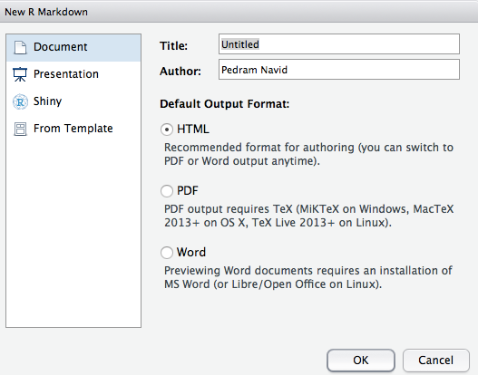

# Starting a Project

##

Structuring your data analaysis projects in a logical way is an important
step toward the five key pillars of good data analysis: reproducability, 
testability, documentation, source control, and peer review.

By organizing your project directory, it makes it easier for others to run your
project and understand what it is doing; to separate out the inputs such as raw
data from the outputs such as charts and reports; and to track changes to your
project using version control.

## Your Homebase

Create a homebase for all your R-related projects. For example, in your
Documents folder, create a folder called **R/workspace**, and store your
projects as subfolders in the workspace folder. 

## Creating a Project

Every time you start a new data analysis project, you should create a new
R project. To do so, use File > New Project and choose New Directory > 
Empty Project. 

Make sure you give the project an intuitive name and that the project is
a subfolder of your home folder for your R projects. 

If using git, make sure *Create a git repository* is checked. If you're not 
sure what git is, it will be covered in a future lesson.

## Workflow

Once you have your shell project created, it is good practice to create
a set of subfolders to store various files you will use for your project. 

Here's my recommended workflow. Some are more essential than others, feel
free to start with the basics (data, src, README, TODO) and add others as your
project grows.

* my_project/
    * data/
    * Rdatasets/
    * output/
    * img/
    * src/
    * README
    * TODO
    
## Folders

Each of these folders serve a specific purpose:

* `data`: any raw data you import. I try my best not to modify these files 
externally. 
* `data/datasets`: any datasets you save that are generated in R are saved here. 
R has a proprietary dataset format that makes it easy to save large datasets
you created within R to reload again later. This is useful when, for example,
you are importing large queries from a database, but don't want to query
the database every time you rerun your project. 
* `img`: any plots or graphs you generate should be save here as an image.
* `output`: any reports you output, such as PDF and Word documents using
R Markdown notebooks are saved here
* `src`: this is where you store the meat and potatoes of your project: your R
code and markdown documents. 
* `README`: a quick introduction to your project that will help people unfamiliar
with your project get quickly up-to-speed with what it does and how it runs.
* `TODO`: notes for yourself (and others) and what you still need to do to
finalize your analysis, including bug fixes and enhancements.

## Your First Code

Create your first bit of code by choosing **File > New File > R Markdown**. 

Give your code a name and you'll see an Rmarkdown template. 

The top bit of the Rmarkdown document provides some general metadata 
which will become part of your document once you render it. 

You'll see some example code below, which you can freely delete. For now,
however, Knit the document. Click the Knit button in the menubar, or choose
File > Knit Document and you'll see a document generated. 

We'll cover RMarkdown documents in detail later, but this general workflow
will be used throughout the course. 

