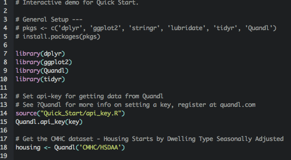
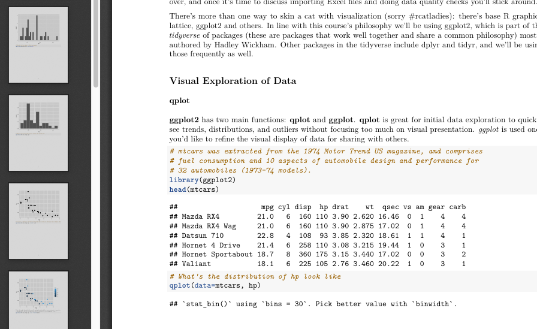

Starting A Project
========================================================
author: Pedram Navid 
autosize: true 
pedram.navid@gmail.com  
github.com/PedramNavid  

Five Pillars of Data Analysis
========================================================

* reproducability: can I give this to someone else to run?
* documentation: can someone follow my work without me explaining it?
* peer review: can someone review my assumptions, analysis, and results?
* testability: can I ensure that I didn't screw anything up?
* source control: can I track my work through time? 

Organizing your Project
========================================================
Supports many of the Five Pillars.  

Can be very subjective, but there are some key principals we should strive for:  
* logical organization: one folder per project, subfolders for different files
* separation of duties: raw preprocessed data shouldn't sit in the same folder as processed data
* consistency: strive to have your projects follow the same structure

Your Homebase
========================================================
Create a homebase for all your R-related projects. For example, in your
Documents folder, create a folder called **R/workspace**, and store your
projects as subfolders in the workspace folder. 

Creating a Project
========================================================
File > New Project and choose New Directory > Empty Project. 

Make sure you give the project an intuitive name and that the project is
a subfolder of your home folder for your R projects. 

If using git, make sure *Create a git repository* is checked. If you're not 
sure what git is, it will be covered in a future lesson.

Workflow
========================================================
Once you have your shell project created, it is good practice to create
a set of subfolders to store various files you will use for your project. 
***
An example structure: 
<small>
* my_project/
    * data/
        * raw/
        * datasets/
    * graphs/
    * reports/
    * src/
    * tests/
    * README
    * TODO
</small>

Where to start?
========================================================

Traditional: R Script
 

***
Modern: R Markdown

