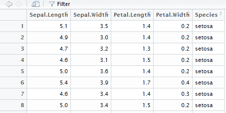

```{r setup, include=FALSE}
PROJ_ROOT <- rprojroot::find_rstudio_root_file()
knitr::opts_chunk$set(echo = TRUE, message = FALSE)
knitr::opts_knit$set(root.dir = PROJ_ROOT)
```

# Transforming Data

## Overview

Why transform? 

> Data rarely comes in the format you want it
> Even if it does, you always want to do something with it
> Good work upfront saves headache down the road, so don't skimp!

## Tidy Data

Data should be tidy when working with R. 
We have a tendency to create untidy data, especially in finance.

"tidy datasets are all alike but every messy dataset is messy in its own way"

Tidy data is:

- Each variable is its own column
- Each observation is in its own row

## First Steps

Use *dplyr* and *tidyr* to help clean and manipulate data.
Check out the cheatsheet: Help > Cheatsheets > Data Manipulation with dplyr,tidyr

## Syntax

```{r}
# Load required packages
library(dplyr) 
library(tidyr) 

# Let's say we have a dataset
iris
```

## A better way: syntax continued
```{r}
iris_easy <- tbl_df(iris)
iris_easy
glimpse(iris_easy)
```

## View
```{r, eval = FALSE}
View(iris_easy)
```



# Tidy Data

## An example:

Is this data tidy? Why/why not?
```{r}
library(readxl)
wide_sales <- read_excel("Transforming_Data/data/wide_data.xlsx")
head(wide_sales)
```

## Reshaping data: gather
```{r}
tidy_sales <- wide_sales %>%
  gather("month", "sales", 2:13)
head(tidy_sales)
```

## Reshaping data: spread
```{r}
tidy_sales %>%
  spread(Region, sales)
```

# Manipulate Data

## Intro to Dplyr

You will spend more time with dplyr than any other R package. 
First thing to understand is the pipe operator: %>% 

%>% passes the result of the previous line to the next line, making your code
much more readable

Consider this fake example:
```{r, eval = FALSE}
miss_muffet_sitting <- sit(miss_muffet, tuffet)
miss_muffet_eating <- eat(miss_muffet_eating, curds_and_whey)
muffet_spider <- sit(miss_muffet_eating, spider, where = 'beside')
muffet_away <- run(muffet_spider, reason = 'frightened')

# Or..

miss_muffet %>% 
  sit(tuffet) %>%
  eat(curds_and_whey) %>%
  sit(spider, where = 'beside') %>%
  run(reason = 'frightened')

```

## dplyr: continued

Best way to learn it is to use it....a lot.
```{r, cache = TRUE}
library(dplyr)
parking <- read.csv("Transforming_Data/data/parking_data.csv") %>%
  tbl_df()
parking
```

# dplyr: select

Pick columns, and optionally rename and reorder them

```{r}
# Pick
parking %>%
  select(date_of_infraction, infraction_description, 5) %>%
  head()
```

## 

```{r}
# Rename 
parking %>%
  select(inf_date = date_of_infraction, desc = infraction_description, fine = 5, time = 6) %>%
  head()
```

##

```{r}
# More picking
parking %>%
  select(starts_with('location')) %>%
  head()
```

## 
```{r}
parking %>%
  select(-starts_with('location')) %>%
  head()
```

# Dplyr: Filter

Subset data using logic

```{r}
parking %>%
  filter(set_fine_amount > 300)
```
##

```{r}
parking %>%
  filter(infraction_code == 355, province != "ON")
```

## Distinct

```{r}
parking %>%
  select(infraction_code, infraction_description) %>%
  distinct()
```
## Samples
```{r}
set.seed(42)
parking %>%
  select(location2, infraction_description, set_fine_amount) %>%
  sample_n(10, replace = FALSE)
```


## Slice
```{r}
parking %>%
  slice(12:15)
```

## Top
```{r}
head(parking, n = 8)
```

## Bottom
```{r}
tail(parking)
```

## Top X
```{r}
parking %>%
  filter(province != "ON") %>% 
  top_n(n = 10, wt = set_fine_amount) %>%
  select(infraction_description, location2, set_fine_amount)
```

# Mutate: make new variables

```{r}
library(stringr)
parking %>% 
  select(2:8, -infraction_code) %>%
  mutate(lower_location = str_to_lower(location2))
```

```{r}
parking %>%
  mutate(fine_tax = set_fine_amount * 0.15, 
    location2 = str_to_lower(location2), 
    comment = "hello world",
    tag_number = str_replace_all(tag_number_masked, pattern = "\\*", replacement = "")) %>%
  select(-tag_number_masked, -infraction_code, -location3, -location4)
```

## rank things
```{r}
parking %>%
  select(tag_number_masked, set_fine_amount) %>%
  mutate(rank = min_rank(-set_fine_amount)) %>%
  arrange(rank)

```

## Group By / Summary

```{r}
parking %>%
  summarise(total_fee = sum(set_fine_amount))

parking %>%
  group_by(province) %>%
  summarise(total_fee = sum(set_fine_amount)) %>%
  arrange(desc(total_fee)) %>%
  mutate(rank = min_rank(-total_fee))
```

## more summary:

```{r}
parking %>%
  group_by(province) %>%
  summarise(mean_amt = mean(set_fine_amount), 
    max_amt = max(set_fine_amount),
    n = n(),
    sd = sd(set_fine_amount)) %>%
  arrange(desc(mean_amt))
```

# joins

```{r}
prov_names <- data.frame(province = c('AB', 'BC', 'MB', 'NB', 'NL', 'NS', 
  'NT', 'NU', 'ON', 'PE', 'QC', 'SK', 'YT'), 
  long_name = c('Alberta', 'British Columbia', 'Manitoba', 'New Brunswick', 'Newfoundland',
  'Nova Scotia', 'Northwest Territories', 'Nunavut', 'Ontario', 'Prince Edward Island', 
    'Quebec', 'Saskatchewan', 'Yukon'))

small_parking <- parking %>%
  select(province, location2, set_fine_amount)

inner_join(small_parking, prov_names) %>%
  filter(province %in% c('NS', 'NY'))
left_join(small_parking, prov_names) %>%
  filter(province %in% c('NS', 'NY'))
anti_join(small_parking, prov_names)

```